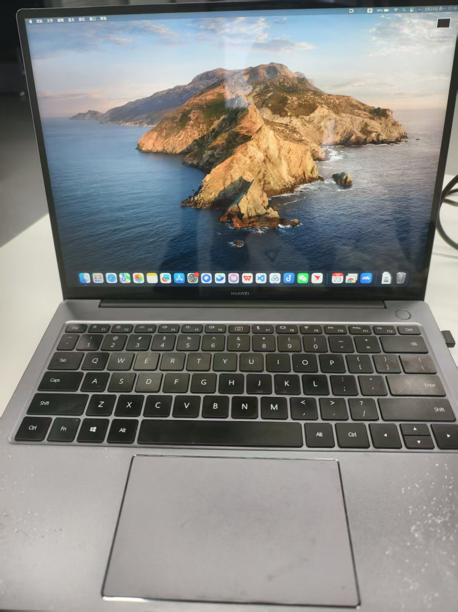

# Huawei MateBook 14 2020 (AMD) Hackintosh OpenCore EFI

This project provides macOS boot support for the Huawei MateBook 14 2020 AMD version (Ryzen). It is based on OpenCore.

Laptops with Ryzen chips from other years of the MateBook series should theoretically be able to use this EFI file as well.

## 💻 Hardware Configuration

| Hardware (Component)      | Model (Details)                                         |
| :------------------------ | :------------------------------------------------------ |
| **Laptop Model**          | Huawei MateBook 14 2020 AMD Version, Touchscreen, 512GB |
| **Processor (CPU)**       | AMD Ryzen 5 4600H                                       |
| **Integrated GPU (iGPU)** | AMD Radeon Graphics 512MB                               |
| **Memory (RAM)**          | 16GB DDR4 2666MHz                                       |
| **Storage (SSD)**         | WD SN730 512GB                                          |
| **Wi-Fi Card**            | Original RTL8822CE replaced with **Intel AX200**        |
| **Audio**                 | Realtek ALC256                                          |

## 🍎 macOS Version

* Tested on: macOS 13 Ventura (13.6.9)
* Bootloader: OpenCore 0.8.8

## ✅ Working Status

* [x] AMD integrated GPU hardware acceleration (via NootedRed)  The screen supports 2K resolution display.

* [x] Speakers & 3.5mm headphone jack

* [x] Microphone

* [x] Wi-Fi & Bluetooth (via AX200 + itlwm/AirportItlwm)

  Note: The original RTL8822CE Wi-Fi card does not work in macOS, so it must be replaced with another chip, such as Intel AX200.

* [x] Touchpad (multi-finger gesture support)

* [x] Touchscreen (multi-finger gesture support), can be used like an iPad in macOS! 😍😍😍

* [x] Keyboard and backlight control keys

* [x] USB and Type-C ports

* [x] Battery status display

* [x] Lid wake-up functionality

* [x] Smooth boot into macOS after startup

## ❌ Known Issues

* [ ] **Bluetooth**: Bluetooth sometimes fails to turn on. If it doesn't work, restart the computer or wait a while. The exact cause is unknown.
* [ ] AirDrop is not working.

## ⛓️‍💥 macOS Image Download

[macOS Ventura 13.6.9 (22G830) Official Release Image - Hackintosh Planet](https://heipg.cn/macos/install-macos-ventura-13-6-9-22g830.html)

Or other official Ventura 13.6.9 (22G830) images.

## ⚙️ BIOS Settings

To enter BIOS, press `F2` during startup:

* Disable Secure Boot.

After booting into OpenCore, you should press the spacebar for the first time and select "Reset NVRAM" to reset.

## 🚀 Installation Instructions

1. Place the EFI folder into the U disk's ESP partition for installation.

## Successful Run Screenshot

## 🙏 Acknowledgments

* Thanks to the [Acidanthera](https://github.com/acidanthera) team for providing OpenCore and various kexts.
* Thanks to [ChefKissInc](https://github.com/ChefKissInc/NootedRed) for NootedRed, which brings life to the AMD integrated GPU.
* Thanks to the [OpenIntelWireless](https://github.com/OpenIntelWireless) team for providing drivers for Intel Wi-Fi cards.
* Thanks to [Dany](https://forum.amd-osx.com/threads/huawei-matebook14-2020-r5-4600h-hackintosh-success-and-some-minor-problems.4618/) for providing MateBook 14 installation EFI configuration files as a reference.
